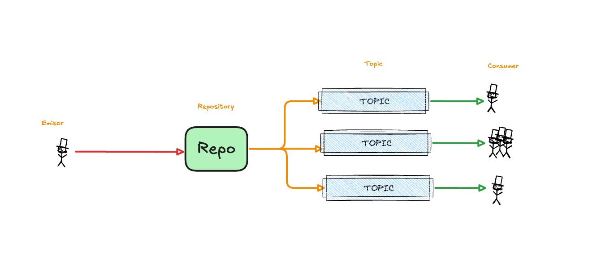

# CarrotBK

CarrotBK it's a side project trying to learn more about message and stream brokers, it gives you the ability to create listen and configure queues:

### SDKS
* [Java](https://rabbitmq.com)
* [Go](https://rabbitmq.com)
* [Typescript](https://rabbitmq.com)

### Diagram
